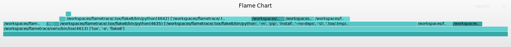

.. highlight:: bash

flametrace
==========

Build flamegraph_ charts for process trees, based on strace.

.. _flamegraph: http://www.brendangregg.com/flamegraphs.html

If you've ever wanted to know why a command is slow, flametrace can help! Run
your command under :command:`flametrace` and get a chart showing what else it
ran inside itself.

.. contents::

Quickstart
----------

Using flametrace is easy, just run any command under :command:`flametrace`::

    $ flametrace tox -e flake8
    ...
    Ran "tox -e flake8" in 10.14s
    strace: /tmp/tox-20210110_213825_852532.strace
    folded: /tmp/tox-20210110_213825_852532.folded
    chart:  /tmp/tox-20210110_213825_852532.svg

This will print an svg filename you can open to diagnose your process.

For example, here is flametrace's output on its own lint process. Use "Right
click > Open image in new tab" to interactively explore the chart.

Interpretation
--------------

The chart produced by flametrace shows you how much process time was spent
running each command, with its ancestors. Since commands might be spawned in
parallel, some commands might appear in the chart to take more time than they
really do. You can click into a child process to expand its children in the
chart.

CLI
===

.. click:: flametrace.main:cli
    :prog: flametrace
    :show-nested:
